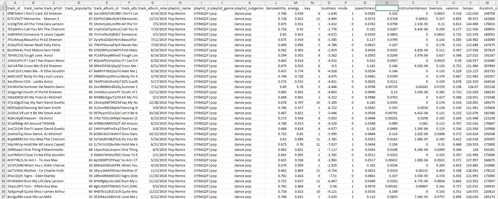

# Spotify Songs Data Analysis Project

## Overview

This project aims to analyze a dataset of 30,000 Spotify songs, exploring various attributes such as track information, album details, and playlist information. The ultimate goal is to provide insights for EDM (Electronic Dance Music) enthusiasts by identifying the top EDM artists.

## Dataset

The dataset, named `spotify_songs`, contains the following columns:

- `track_id`: Song unique ID
- `track_name`: Song Name
- `track_artist`: Song Artist
- `track_popularity`: Song Popularity (0-100)
- `track_album_id`: Album unique ID
- `track_album_name`: Song album name
- `track_album_release_date`: Date when the album was released
- `playlist_name`: Name of the playlist
- `playlist_id`: Playlist ID
- `playlist_genre`: Playlist genre
- `playlist_subgenre`: Playlist subgenre
- ... (and other attributes related to danceability, energy, key, loudness, mode, speechiness, acousticness, instrumentalness, liveness, valence, tempo, and duration)

## Project Structure

The project is organized into three sheets in Excel:

1. **FACT_Track_Info:**
   - Contains detailed information about each track, including track ID, name, artist, popularity, album ID, playlist ID, danceability, energy, key, loudness, mode, speechiness, acousticness, instrumentalness, liveness, valence, tempo, and duration.

2. **DIM_Track_Album:**
   - Contains information about the albums, including album ID, album name, and release date.

3. **DIM_Track_Playlist:**
   - Contains information about the playlists, including playlist name, playlist ID, genre, and subgenre.

## Data Processing in Excel

- Imported the dataset into Excel.
- Created three sheets based on the project requirements.
- Managed and organized data in each sheet, ensuring consistency and accuracy.

## Visualization in Power BI

- Loaded the Excel sheets into Power BI.
- Created relationships between sheets.
- Implemented DAX formulas to:
   - Calculate Total Tracks, AVG Popularity, AVG Energy
   - Categorize loudness into five bins.
- Visualized data using Power BI, emphasizing the distribution of loudness bins.
- Focused on identifying top EDM artists using track popularity.

## How to Use

1. Download the dataset (`spotify_songs`) and the Excel file.
2. Open the Excel file to explore the organized data in the three sheets.
3. Open the Power BI file to interact with visualizations and gain insights.

Feel free to customize and expand upon this project to meet your specific needs. Contributions and suggestions are welcome!
